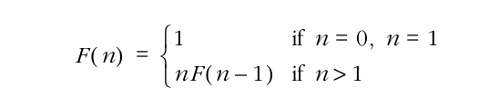

# Scope
- ## [Algorithms](#algorithms)


## Algorithms

- ### Recursion

	- The basic recursion is basically separating the problem into smaller instances of the main problem, where each recursive call is a "subproblem".

	- Tail recursion is a form of recursive function where the recursive function call is the last code to be executed by the calle. Most of time, it will be the last statement as well, for example:

	```
	return a * recursive(n-1); // after recursive() is called, the expression will be evaluated;

	return recursive(n,(n-1) * a); // no code will be executed after the call, then it is tail recursive;
	```
	Note: by using the tail recursion, the compiler will optimize your code so the stack frame does not grow and there is unwinding code, but it is replaced by the next recursive call activation

- ### Side-Notes

	- We can represent a recursion function for factorials in a mathematical system:

	
	
	
	- Recursion functions have a winding and unwinding phase.
