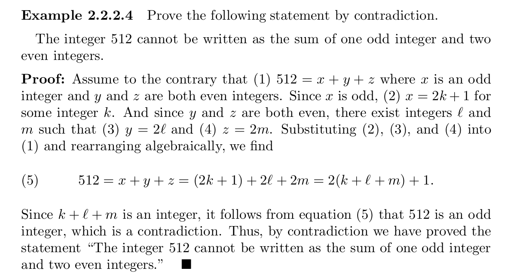

# Scope
- ## [Proofs](#proofs)
- ## [Algorithms](#algorithms)
- ## [Nextjs](#nextjs)


## Proofs

- ### day18

	- Proof of biconditional statements: Similar to proof by exhaustion. (P ⇒ Q) ∧ (Q ⇒ P).

	- Proof by contradiction of P aka _reductio ad absurdum_: P ≡ ((¬ P) ⇒ C), where C is a contradiction. 
	Example:
	

	- Fundamental Theorem of Arithmetic: every natural number greater than 1 is a prime or can be written as a product of primes.

## Algorithms

- ### day18

	- Just read about efficiency of algorithms, abstraction, and reusability. There are types of algorithms:
	- Randomized algorithms;
	- Divide-and-Conquer;
	- Dynamic Programming solutions;
	- Greedy Algorithms.

- ### day19
	
	- Void pointers can be used to deal with any type of data;
	- When using multidimensional arrays as parameters, you need to specify the column limit (array[][2]). For pointer arithmetic.

- ### day21

	- Recursion: Divide your problem into subproblems, smaller instances of the problem, like a factorial function.
	- Basic recursion: Any function that calls itself to solve a problem is considered a recursive function.
	- Tail recursion: Optimized by compiler, tail recursion happens when the recursive call is the only thing left to be executed by the calle (the function code as a whole):
	```
	return a * recursive(n-1); // after recursive(), the expression will be evaluated, this means there are code left to be executed after the call;
	
	return recursive(n-1,a * n); // no code will be executed after recursive();
	```

	- By being optimized by the compiler, the stack frame does not grow and the activation record is replaced by subsequent recursive calls, this means no unwinding phase.

	- Representation of recursive functions in a mathematical system: I found this interesting:
	

## Nextjs

- ### day19
	
	- Object Destructuring: Destructure objects:
	```
	function Header({ title }) // prop object, getting only prop.title
	{
		console.log(title);
		return <h1>React</h1>
	}
	```
	
	- Links: Link components in React and Nextjs are faster than simple ```<a>```, use it for internal links, for external links/pages use ```<a>``` instead.
