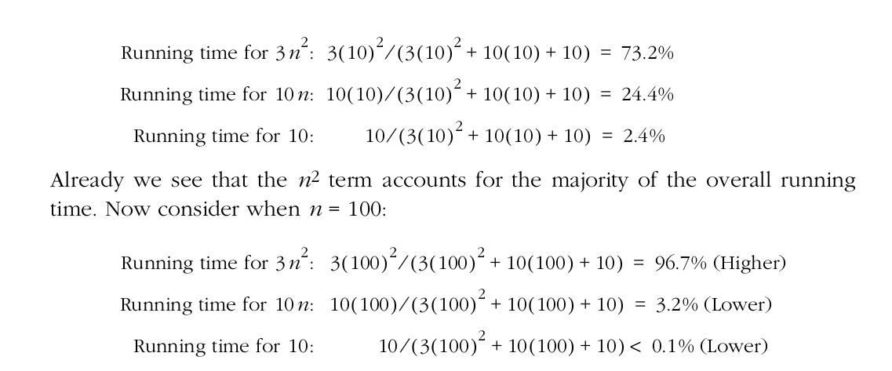

# Scope
-  [Algorithms](#algorithms)


# Algorithms

- Worst-case analysis: When considering all cases an algorithm can take, there will be the worst case possible. It is useful to analyse an algorithm by its worst case because we can determine an upper bound on performance, since it can have a worse situation for the algorithm. 

- O-notation: The common notation for measuring an algorithm's performance. The O-Notation defines an upper bound for the algorithm, where _n_ is the data size for some function _f(x)_:

	- Constants and multiplicative constants: As the complexity of the algorithm grows, constants and multiplicative terms are omitted, since they make almost no difference in the result as the _n_ grows. \
	This happens when you know the exact time an algorithm will take to complete, or when _c_ tasks of an algorithm execute at the same amount of time:
	```
	O(c) = O(1)

	O(cT) = cO(T) = O(T)
	```

	- Addition: Add the time of the tasks and take the maximum of the result. \
	This happens when two or more tasks are sequentially executed:
	```
	O(T1) + O(T2) = O(T1 + T2) = max(O(T1),O(T2))

	Example: O(n) + O(n^2) = O(n^2)
	```

	- Multiplication: Just write in a more compact form. \
	This happens when you have an iteration inside an iteration.
	```
	O(T1) * O(T2) = O(T1*T2)

	Example: O(n) * O(n) = O(n^2)
	```

	- Practical example: \
	```
	O(T(n)) = O(3n^2 + 10n + 10) = O(n^2)
	```

	
