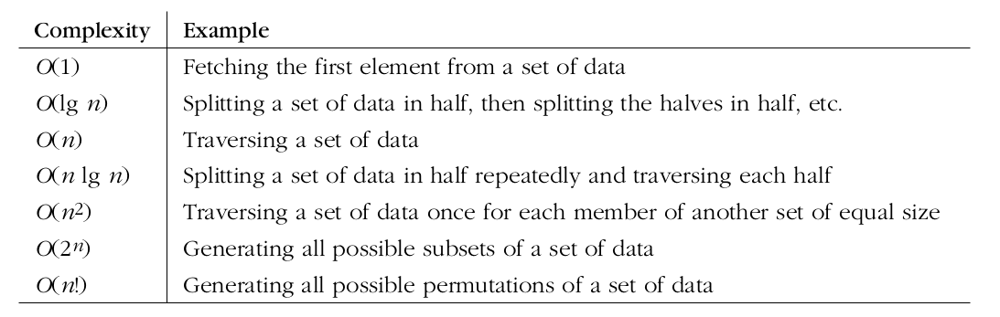
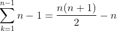

# Scope
- [Algorithms](#algorithms)
- [Proofs](#proofs)

# Algorithms

- **Computational Complexity**: The complexity of a program is measured by the amount of resources (time, for example) it uses. Using O-Notation is an example of algorithm analysis. We do not need to be precise about growth rates, so constants are ignored (consider them when two algorithms have same complexity). \
\
Complexity analysis say little about the actual time the algorithm takes. If an algorithm is O(n), it does not mean it will run at in small amount of time, but it means that the algorithm varies proportionally to _n_, and that _n_ is an upper bound for T(n) (the algorithm function itself, not O(n)) within a constant factor. \
\
We say that T(n) <= cn (this happens because cn consider external factors, not regarding on the algorithm), where the constant is a constant factor that accounts for various costs not associated with the data, such as the type of computer on which the algorithm is running, or the compiler used.\
\
\
\
Analysing the insertion algorithm, we found that the representation formula of it is a summation:\
\
\
\
Note: It is not (n-1)(n-1) because the sequence of the inner loop is n-1,n-2,n-3... In a multiplication, the term never changes, so say 3n = n + n + n.

- **Automata Theory**: In a deterministic turing machine, the set of rules prescribes at most one action to be performed for any given situation. \
\
In a non-deterministic turing machine, the set of rules specify more than one possible action when in some given situations, that is, an NTM's next state is not completely determined by its action and the current symbol it sees. \
\
**P versus NP problem**: A problem that can be verified quickly can be solved quickly? In other words, If the solution to a problem is easy to check for correctness, must the problem be easy to solve? (Quickly here means solve in polynomial time). \
\
P and NP stand for **complexity classes**. It seems that complexity classes will bring me into a mathematical view of computation and automata theory (my opinion).


# Proofs

- **Proofs of statements with quantifiers**: It may not be stated explicitly, but most of mathematical proofs have quantifiers. The universe of discourse (showed in the book as the set _U_, which is the opposite of an empty set) may not be stated explicitly, but it can be understood from context. \
\
**Proof of Universal Quantifier(∀x ∈ U)(P(x))**: Let x ∈ U ... P(x) is true. Hence, (∀x ∈ U )(P(x)) is true. Example:

``` 
For all odd integers n, the integer n^2 is odd 
n^2 = (2k+1)^2 = 4k^2 + 4k + 1 = 2(2k^2 + 2k) + 1
``` 
- This statement from the example is logically equivalent to "If _n_ is an odd integer, then n^2 is an odd integer", notice that it can represent all the universe _U_ from the previous example, since we are letting n be an arbitrary number, so we assume n is an element from _U_ and P(x) is true, then we deduce Q(x) is also true. Consequently, to prove (∀x ∈ U )(P(x) ⇒ Q(x)), we let x be an arbitrary element of the universal set U, so x ∈ U, P(x) ⇒ Q(x). \
\
So "For all...Q(x)" ≡ "If P(x)...then Q(x), where x is a arbitrary number from the universe of discourse of the first statement".
