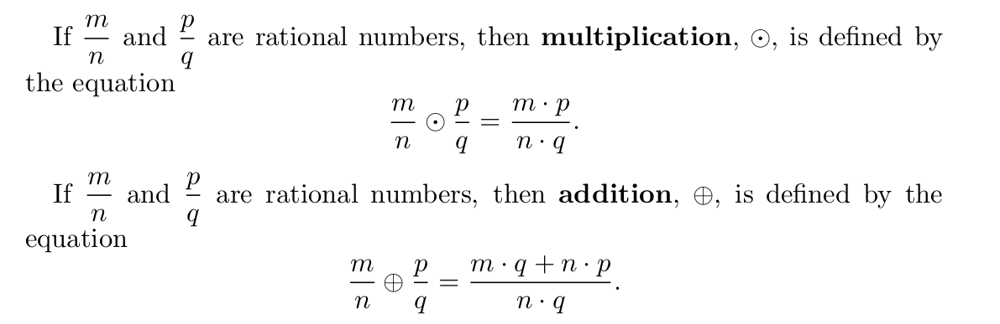
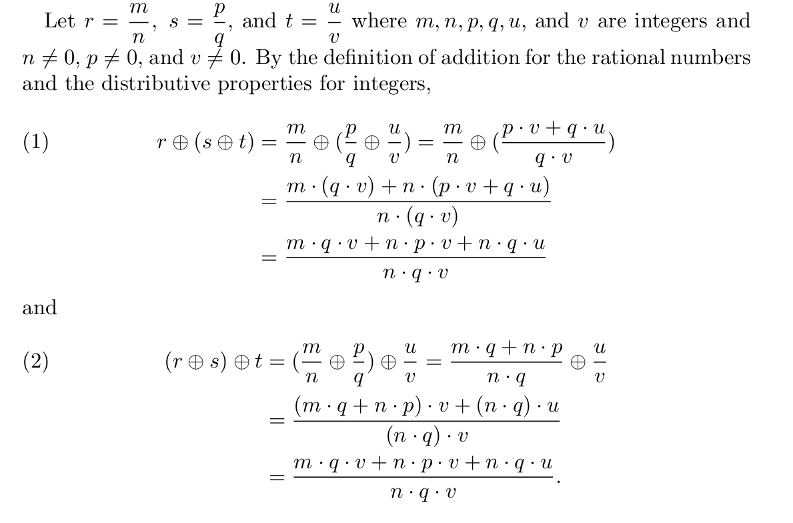
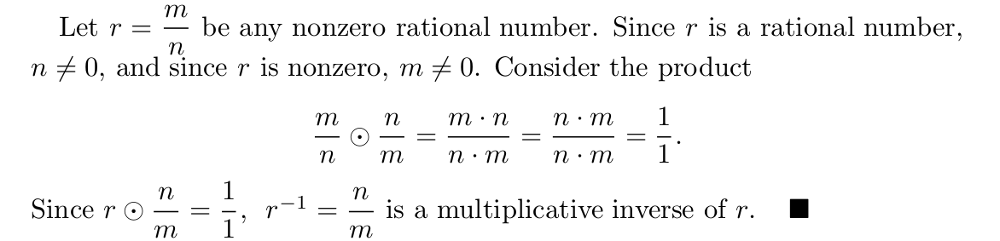

# Scope

- [Proofs](#proofs)

# Proofs

- **Reduced form of a rational number**: A rational number n / m is in reduced form or simplest form if n and m have no factors in common except for the number one.

- **Multiplication and addition of rational numbers**: We define multiplication and addition of rational numbers in terms of multiplication and addition of integers. \
\

- **Associative Property of Addition for the Rational Numbers**: \
\

- **The existence of a Multiplicative Inverse Property for the set of rational numbers**: \
\

