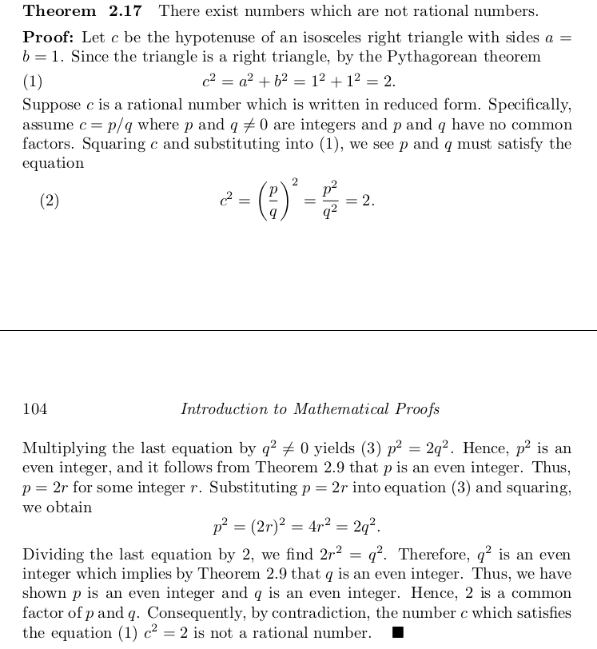
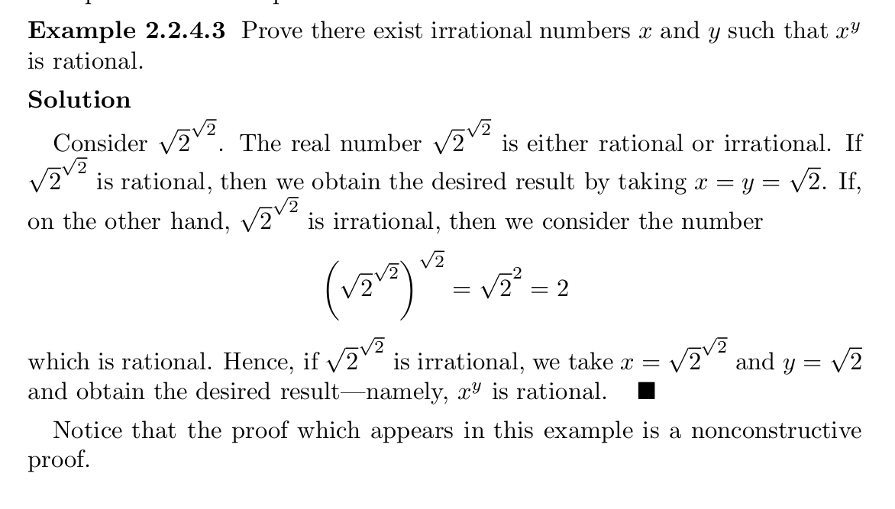

# Scope

- [Proofs](#proofs)

# Proofs

- **There exist numbers which are not rational numbers**: \
\

- **Prove there exist irrational numbers x and y such that x^y is rational**: \
\

- **Side-notes**: A conjecture is such a mathematical statement whose truth or falsity we do not know yet. In other words, a statement that you believe to be true but have not proved to be true is a conjecture. \
\
Axioms or postulate is defined as a statement that is accepted as true and correct, called as a theorem in mathematics. A mathematical statement which we assume to be true without a proof is called an axiom.
