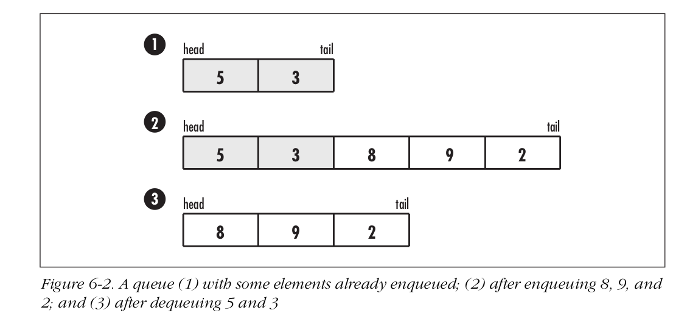

# Scope

- [Algorithms](#algorithms)

# Algorithms

- **Description of Stacks**: The stack retrieves and stores data in a LIFO (Last-in, first-out) manner, that is, the last element placed on the stack is the first to be removed.

- **Traversing stacks**: Suppose we want to traverse the elements of a stack, perhaps so we can display them or determine whether a specific element resides in the stack. We can implement linked lists to simplify this process. To do this, we get the element at the head of the list using list_head and traverse the list using list_next. \
\
Using only stack operations, we would have to pop the elements one at a time, inspect them, and push them onto another stack temporarily. Then, after accessing all of the elements, we would need to rebuild the original stack by popping the elements off the temporary stack and pushing them back onto the original one.

- **Description of Queues**: A queue stores and retrieves data in a FIFO (first-in, first-out) manner, that is, the first element placed in the queue is the first to be removed. \
\
In computing, to place an element at the tail of a queue, we enqueue it, to remove an element from the head, we dequeue it. Sometimes it is useful to inspect the element at the head of a queue without actually removing it, in which case we peek it. \
\

- **Side-notes**: _Sometimes we need to remove an element from a queue out of sequence (i.e., from somewhere other than the head). What would be the sequence of queue operations to do this if in a queue of five requests, 〈req1, . . . , req5 〉, we wish to process req1, req3 , and req5 immediately while leaving req2 and req4 in the queue in order? What would be the sequence of linked list operations to do this if we morph the queue into a linked list?_ \
\
Using queue operations, we dequeue req1 for processing, dequeue req2 and re-enqueue it, dequeue req3 for processing, dequeue req4 and re-enqueue it, and dequeue req5 for processing. Because we re-enqueued req2 and req4, the queue now contains only these requests in order. Removing requests out of sequence is more intuitive when we treat the queue as a linked list and apply linked list operations to it. In this case, we simply call list_next to traverse the requests one at a time and list_rem_next to remove the appropriate requests.
