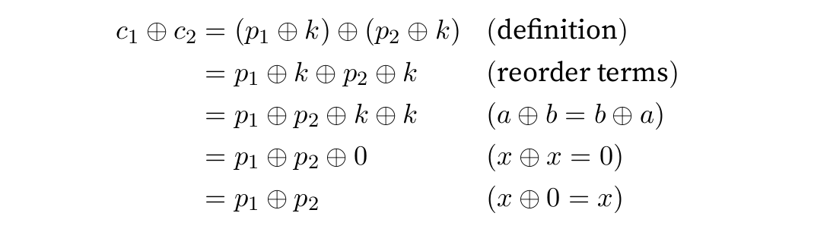
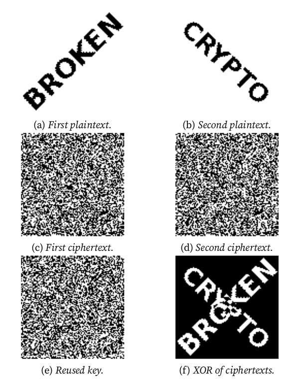

# Scope

- [Crypto](#crypto)

# Crypto

- **One-time pads**: The "pad" is a sequence of random or pseudo-random bits which is used with a plaintext in a bitwise XOR operation to encrypt a message. If the bits of the pad are truly random and the pad is used only once, the attacker learns nothing about the plaintext when he sees a cyphertext. If the key (the pad) is reused, an attacker can XOR the two cyphertexts, which is logically equivalent to the XOR of the plaintexts: \
\
 \
\

- **Block ciphers**: a block cipher is an algorithm that encrypts blocks of a fixed length. A block cipher is an example of a symmetric-key encryption scheme, the same secret key is used for both encryption and decryption.
